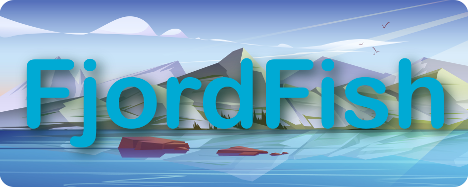

# Coastal Cod Re-ID
## Resources for developing individual re-id cod coastal cod (Gadus morhua)
This project contains code, dataset information and links to model weights for our project on deep-learning-based individual re-id of coastal cod.

For specific information on related datasets see the icons below:

<table>
  <tr>
    <td align="center" valign="middle"></td>
    <td align="center" valign="middle"></td>
  </tr>
  <tr>
    <td align="center">Dataset for ID of individual coastal cod</td>
    <td align="center">Dataset for general North Atlantic fish detection</td>
  </tr>
</table>

## Summary
